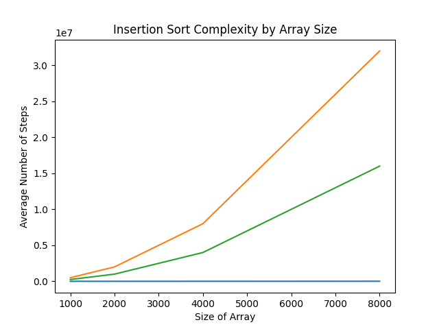

.. _chap-plotting-data-with-matplotlib:

=============================
Plotting Data with Matplotlib
=============================

.. _sec-plotting-data-introduction-and-motivation:

Introduction and Motivation
===========================

In the previous chapter we used the CSV utilities that the Pandas library
provides to read a CSV and select certain parts of its data, and we've finally
built up to the point of plotting that data and making it display nicely.

.. _sec-how-does-matplotlib-work:

How does Matplotlib Work?
=========================

The general workflow we're going to follow in this chapter is as
follows:

#. Load data from a CSV into a dataframe using Pandas

#. Do any sort of data manipulation we need

#. Tell Matplotlib to plot that data (it won't show anything yet) 

#. Change features of the graph while it is still loading

#. Show the final graph

.. _sec-plotting-different-charts:

Simple charts with Fake Data
============================

First, I want to do a couple charts on fake data to show the very basics of how
we can use Matplotlib. Just **download** :download:`simple_data.csv
<code/simple_data.csv>` (by clicking that text) and upload it to your Replit
using the three dots menu in the corner of the file browser pane.

Before plotting, go ahead and take a look at what's inside that file by opening
it in Replit. As you can see it's pretty simple, it keeps track of different
decades and their ability to be the future. Why, you ask? I just wanted an
obvious and stupid trend to follow.

Let's make a new function that will plot the data from this CSV file start off
with code that looks like this.

.. code-block:: python

   def plot_fake_data():
      # Read in the CSV as usual
      data = pd.read_csv("simple_data.csv")

      # Tell Matplotlib to make a line plot and specify which data to use
      # "Year" will be the X axis, and futuristic-ness will be the Y axis
      plt.plot(data["Year"], data["General Futuristic-ness"])

      # Show the plot when we're done
      plt.show()

If you now run this code, you should get the following somewhat underwhelming
graph.

.. note:: 

   If you can't see your graph in Replit for any reason, either navigate to the
   "Output" pane or create a new tab and assign it to the Output pane.

However, this lacks something that is generally pretty important for graphs:
axis labels and a title. To add those, we can use the ``plt.xlabel``,
``plt.ylabel``, and ``plt.title`` commands as shown below. Note how we make sure
to put these commands before showing the plot, so that their changes actually
get applied.

By the way, I've removed the imports from this code block to keep it all
cleaner. You'll still need the imports in your own file, of course!

.. code-block:: python
   :emphasize-lines: 8-10

   def plot_fake_data():
      data = pd.read_csv("simple_data.csv")

      # Plot the data simply
      plt.plot(data["Year"], data["General Futuristic-ness"])

      # Set axis labels and title
      plt.xlabel("Year");
      plt.ylabel("General Futuristic-ness")
      plt.title("The Future Comes for Us All")

      plt.show()

You can run the program again to see how this changes things, but I want to add
one more interesting feature to the graph first. How about a line that shows
the tipping point between the past and future? That is, where the
futuristic-ness of a decade is exactly equal to zero. For that, we can use the
command ``plt.axhline`` as follows.

.. code-block:: python
   :emphasize-lines: 13 

   def plot_fake_data():
      data = pd.read_csv("simple_data.csv")

      # Plot the data simply
      plt.plot(data["Year"], data["General Futuristic-ness"])

      # Set axis labels and title
      plt.xlabel("Year");
      plt.ylabel("General Futuristic-ness")
      plt.title("The Future Comes for Us All")

      # Horizontal line at y = 0
      plt.axhline(0, color="red")

      plt.show()

Now, your plot will look like this! Still basic, but much easier to understand.

.. image:: images/simple_fake_plot_hline.png

Using Real Data
===============

I have one particular example of plotting real data that I want to walk through,
based on our sorting algorithms lab from earlier this semester. Once again, you
can **download** :download:`sorting_algorithms.csv <code/sorting_algorithms.csv>` by
clicking on that piece of text. Once it's uploaded to Replit, we can start out
looking at the data and figuring out how to plot it.

We did a good amount of stuff with this data in class, but the one thing that I
think is particularly visually entertaining is just a line plot of how insertion
sort compares on different sizes of arrays with different initial orderings. For
that, we'll need to plot multiple lines with a function somewhat like this one:

.. code-block:: python

   def plot_insertion_sort():
       data = pd.read_csv("sorting_algorithms.csv")

       # Call plot three times to put three lines on the chart
       plt.plot(data["Array Size"], data["Insertion (Ascending)"])
       plt.plot(data["Array Size"], data["Insertion (Descending)"])
       plt.plot(data["Array Size"], data["Insertion (Random)"])

       # Set the titles, as usual
       plt.xlabel("Size of Array")
       plt.ylabel("Average Number of Steps")
       plt.title("Insertion Sort Time Complexity by Array Size")

       # And show it!
       plt.show()

When you run this, it'll make a graph that should look something like this:

This is fine, but it's hard to tell which data is which. You could definitely
intuit it from how you know the algorithm works, but let's add a legend to clear
everything up. For this case, we'll handle that like so:

.. code-block:: python
   :emphasize-lines: 15

   def plot_insertion_sort():
       data = pd.read_csv("sorting_algorithms.csv")

       # Plot data
       plt.plot(data["Array Size"], data["Insertion (Ascending)"])
       plt.plot(data["Array Size"], data["Insertion (Descending)"])
       plt.plot(data["Array Size"], data["Insertion (Random)"])

       # Add titles and things
       plt.xlabel("Size of Array")
       plt.ylabel("Average Number of Steps")
       plt.title("Insertion Sort Time Complexity by Array Size")
      
       # Add the legend with these labels
       plt.legend(["Ascending Order", "Descending Order", "Random Order"])

       plt.show()

There definitely exist more sophisticated ways to show a legend (after all, we
have the names of everything stored in the Pandas dataframe already), but in
this case we'll stick with manually matching the order. As a little bonus, that
lets us customize things to what the plot is showing, rather than the broader
scope of the whole collection of data.

More Possibilities with Matplotlib
===================================

Matplotlib is a truly huge library, and it can do a lot more than we've touched
on here. For some truly stunning examples, I recommend you check out all the
different `types of graphs Matplotlib can create
<https://matplotlib.org/stable/plot_types/index.html>`_. In particular, some of
my favorites from that page are the `contour plot
<https://matplotlib.org/stable/plot_types/arrays/contourf.html#sphx-glr-plot-types-arrays-contourf-py>`_
and the `3D surface plot
<https://matplotlib.org/stable/plot_types/3D/surface3d_simple.html#sphx-glr-plot-types-3d-surface3d-simple-py>`_.

.. note::

   Most of the examples in Matplotlib's documentation use a library we haven't
   really talked about called NumPy. One of the biggest features NumPy brings to
   the table is another really powerful datastructure called arrays. I won't get
   into them here, but you might notice that some of the examples are able to
   apply functions or random values to entire arrays at once. That's the main
   reason they're so good for these examples.
